```mermaid
flowchart LR
    A[/Config file 📄/] --> B([Bamboo 🎍])
    B --> C[(Dataset)]
```

---
# You can also start simply with 'default'
theme: seriph
background: ./media/bamboo_background.jpg
# Informations about this presentation
title: Bamboo 🎍
info: Bamboo presentation
class: text-center
drawings:
  persist: false

transition: fade-out

# enable MDC Syntax: https://sli.dev/features/mdc
mdc: true
hideInToc: true
---

# Bamboo 🎍
Configuration-based data generation

  Let's go! <carbon:arrow-right />

<!--
Bienvenue à cette présentation ! Je vais vous parler de Bamboo, un outil permettant de configurer sa génération de jeu de données !
-->

---
transition: fade-out
hideInToc: true
---

# Summary

<Toc text-sm minDepth="1" maxDepth="2" />

---

# 🎍 About
 
 
 

<h2>Bamboo is about <b>configuring</b> your data generation!</h2>
 

---
transition: None
---

# 🤔 Why?
*A bit of storytelling*
 
 

During Machine Learning classes, we needed data to practice...  
Teacher(s) asked us to go for **data scraping**...  

<v-click></v-click>

---
hideInToc: true
---

---
hideInToc: true
---

# 🤔 Why?
*A bit of storytelling*

<h2> Also web scraping is kinda <del>illegal</del> <b>risky</b></h2><i>(hello robot.txt)</i>

More information here : [Is web scraping legal? A short guide on scraping under EU law - Patrycja Szwed, 2021](https://discoverdigitallaw.com/is-web-scraping-legal-short-guide-on-scraping-under-the-eu-jurisdiction/)

---
hideInToc: true
---

# 🤔 Why?
 
 

<h2>🤯 No more <u>web scraping</u>!</h2>

 

<h2>🤩 Work on <u>true use case</u> data</h2>

 

<h2>😎 Generate data with your own <u>expectations</u></h2>

---

# 💥 How it works?

foo

---

# 🗺  Roadmap

foo

---

# Sprout you data, but under control !
